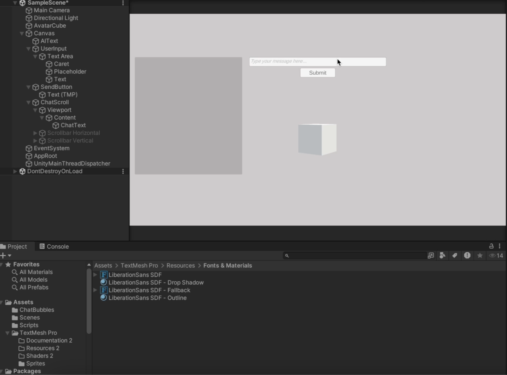
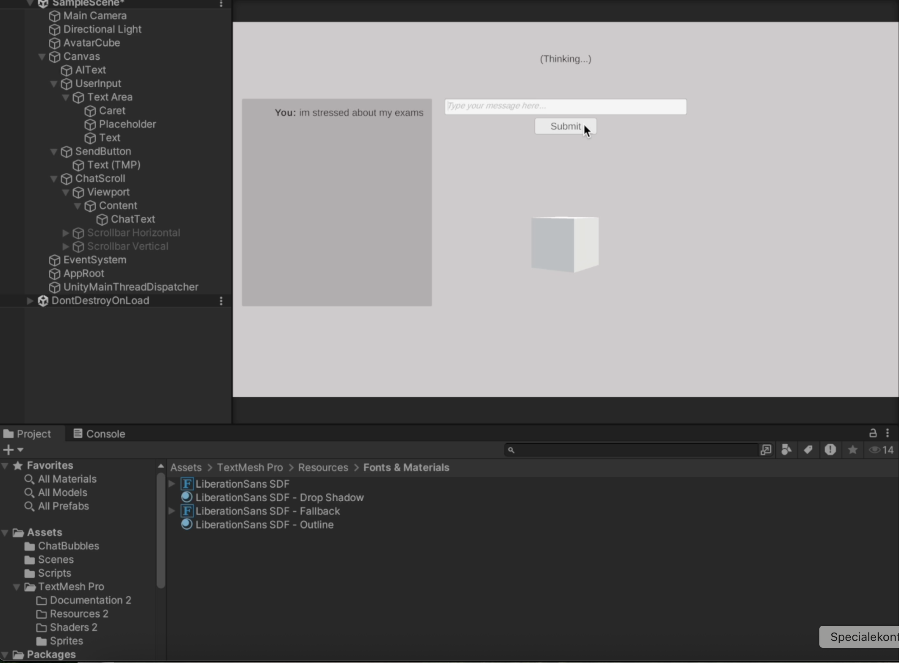
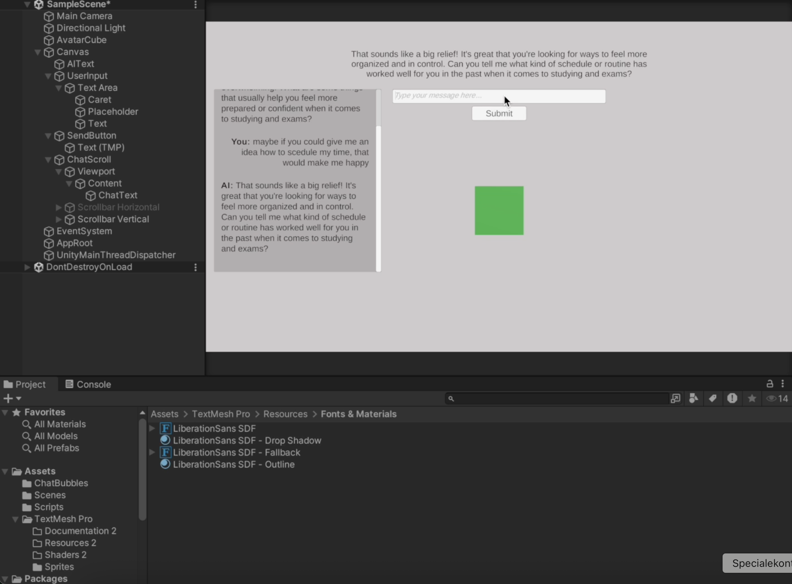
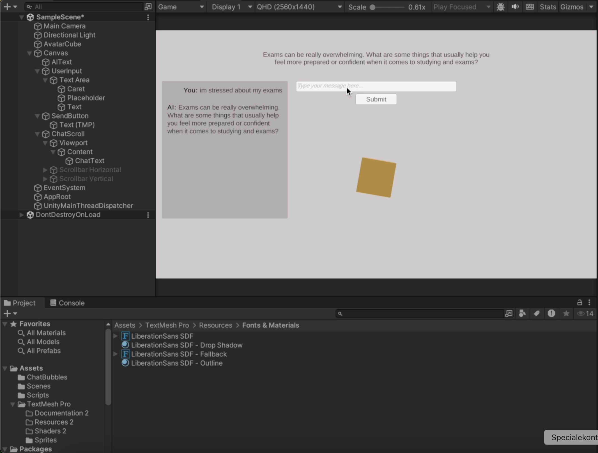
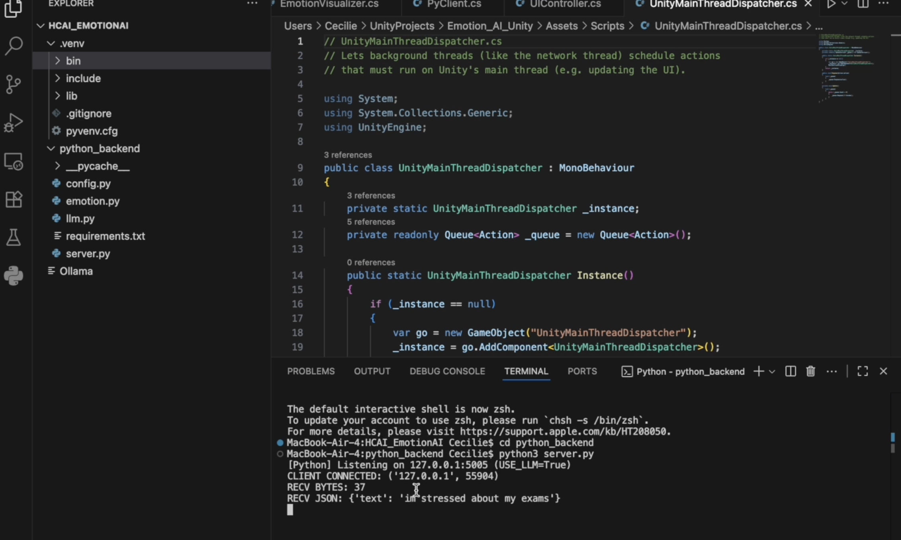

# Emotion-Driven Human-AI Interaction

An interactive AI system exploring how emotionally aware responses can be created in real time through the combination of Unity, Python and large language models.

---

## Demo

 
   

 
  <a href="https://github.com/ceciliestadekristensen/emotion-driven-human-ai-interaction/raw/main/demo/demo.mp4">▶ Watch full demo video</a> 

---

## Overview

This project explores how AI systems can interpret and respond to human emotions in a more natural and engaging way.

The solution combines a Unity-based interface with a Python backend and LLM-based response generation to create a real-time interaction flow between the user and the system.

The project focuses on both implementation and interaction design, showing how multiple technologies can be connected into one coherent user experience.

---

## System Architecture

The system is structured as follows:

- Unity handles the user interaction and visual feedback
- Python manages backend processing and the system logic
- LLM generates emotionally aware responses
- Communication between components happens via API calls 

---

## Technologies
- Unity (frontend / interaction)
- Python (backend logic)
- Large Language Models (LLMs)
- API-based communication

---

## Features
- Real-time interaction between user and AI  
- Emotion-based feedback through UI  
- Integration between Unity and Python backend  
- LLM-driven conversational responses  

---

## Screenshots

### Interface & Interaction

<table align="center">
  <tr>
    <td align="center">
       
      <b>Main Interface</b>
    </td>
    <td align="center">
       
      <b>Thinking State</b>
    </td>
  </tr>
  <tr>
    <td align="center">
       
      <b>Happy State</b>
    </td>
    <td align="center">
       
      <b>Stressed State</b>
    </td>
  </tr>
</table>

---

### System Integration

   
  <b>Unity-Python Integration</b>

---

## Report

This project was developed independently as part of my Human-Centred AI Interaction (HCAI) course.

The full academic report is available here:

[Download Report (PDF)](https://github.com/ceciliestadekristensen/emotion-driven-human-ai-interaction/raw/main/report/Human_Centred_AI.pdf)

---

## Learning Outcome

This project strengthened my experience in:

- Building multi-component systems
- Connecting frontend and backend logic
- Working with AI integration
- Designing interactive experiences across technical layers

---

## Purpose

The purpose of the project was to explore how emotionally responsive AI interaction can be designed and implemented through the integration of interface design, backend logic and language model technology.

---
